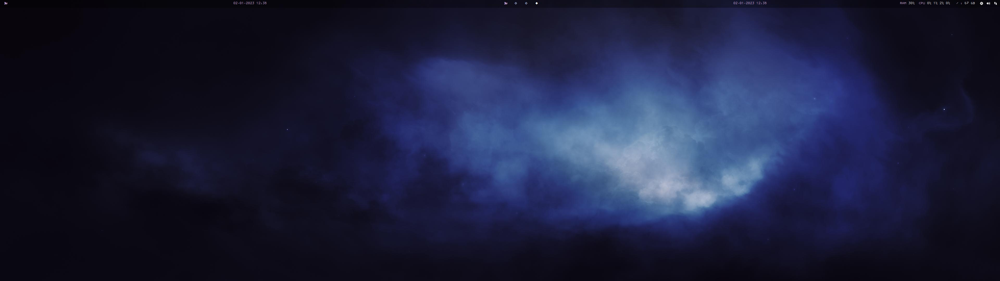
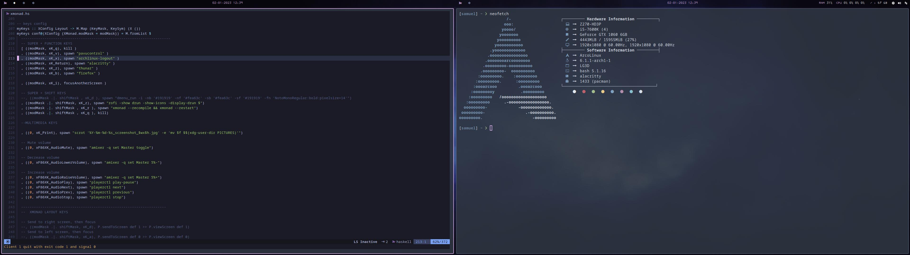

# XMonad

Configuration files for the XMonad window manager that works for two monitors.
Not finished yet, it is a work in progress. 

##  Keybindings

| Key  | Action |
| ------------- | ------------- |
| Mod + q       | kill focused window  |
| Mod + v  | pavucontrol  |
| Mod + x  | arcolinux logout  |
| Mod + Return  | alacritty  |
| Mod + z  | thunar  |
| Mod + b  | firefox  |
| Mod + Shift + v  | rofi  |
| Mod + Shift + r  | recompile and restart  |
| Mod + Shift + d  | send to other screen |
| Mod + Shift + f  | toggle float  |
| Mod + f  | toggle fullscreen  |
| Mod + Space | Cycle layouts  |
| Mod + Shift + Space  | Reset to def layout  |
| Mod + j  | focus next window |
| Mod + k  | focus prev window |
| Mod + Down  | focus prev window  |
| Mod + Up  | focus next window  |
| Mod + m  | focus master window  |
| Mod + Right  | focus other screen  |
| Mod + Shift + m  | swap master  |
| Mod + Shift + k  | swap up  |
| Mod + Shift + j  | swap down |
| Mod + Shift + h  | shrink |
| Mod + Shift + l  | expand |

## Screenshots

